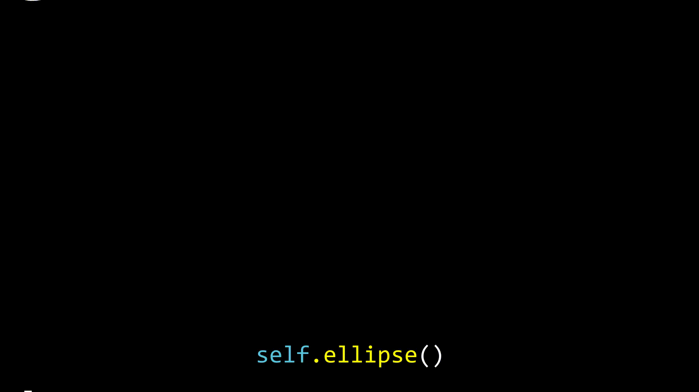

Hello Math Animator
=================================

Here are my codes for Manim. Feel free to explore and reuse them all.

Cool Effect
======================
A reddit use asks if Manim can animate text as 
https://zulko.github.io/moviepy/examples/moving_letters.html

And sure enough you can! See the example below and find the corresponding code in ``cool_effect.py`` (cool_effect.py)

