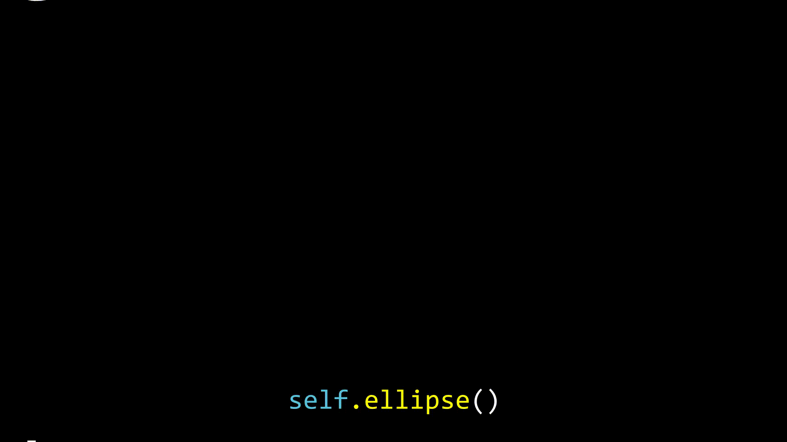

# Manim collection

I have a collection of Manim codes [here](https://github.com/lemononmars/manim/tree/master/myprojects). Feel free to explore and reuse them all. 

Below are some featured codes.

## Exponential Sum
[``exponential_sum.py``](exponential_sum.py)

## Cool Effect
You can create text animations as seen [here](https://zulko.github.io/moviepy/examples/moving_letters.html).

See the example below and find the corresponding code in [``cool_effect.py``](test/cool_effect.py)

## Lyric Video
It turns out you can make a lyric video! [``song.py``](for_fun/song.py)

Ignoring fancy animations, there's one main trick here. ``time.perf_counter()`` is for compiler, not for animation. You have to jump forward to a specific timestamp using ``self.wait(timestamp - self.time)``.
